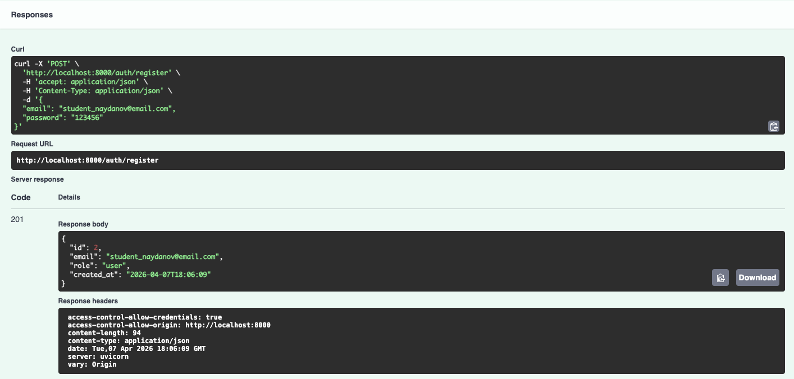
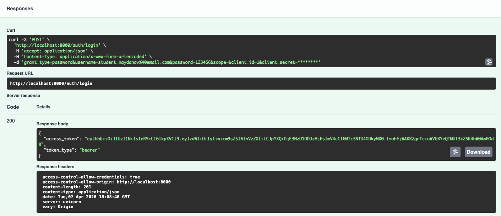
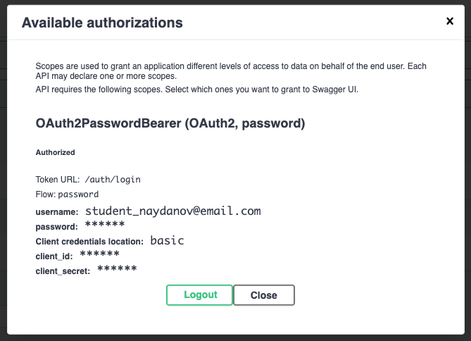
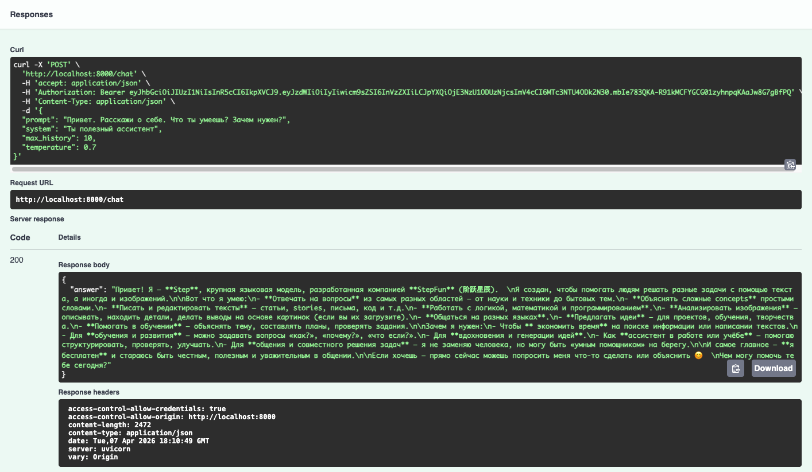
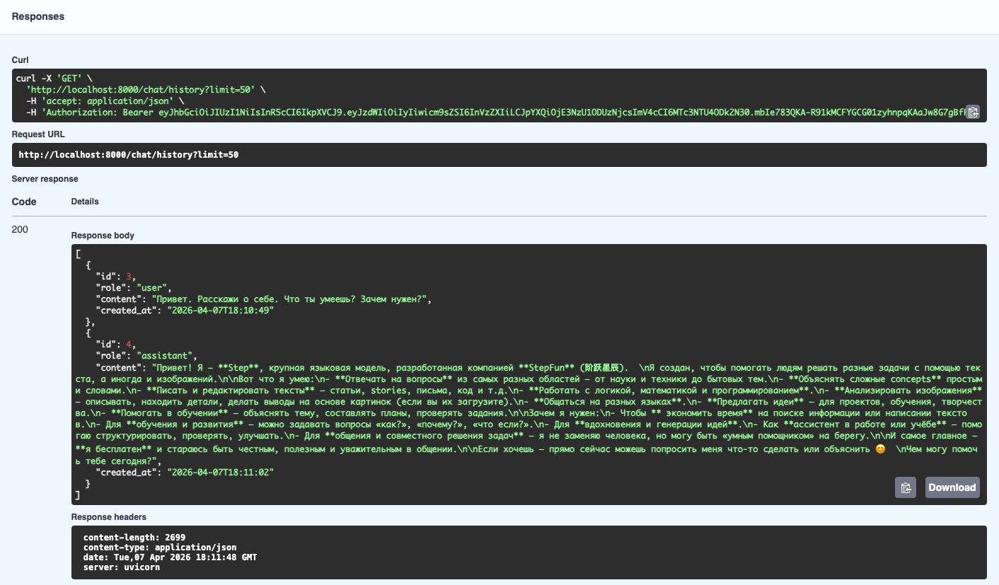
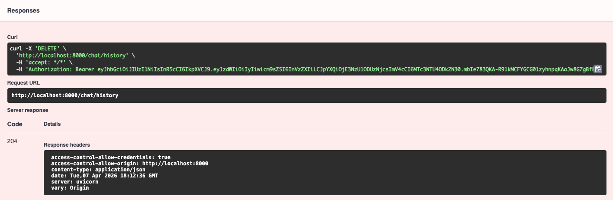

# LLM-P: Защищённое API для работы с LLM через OpenRouter

FastAPI сервис с JWT аутентификацией, SQLite и интеграцией OpenRouter.

## 📋 Требования
- Python 3.11+
- uv

## 🚀 Установка и запуск

### 1. Установка uv
```bash
pip install uv
```

### 2. Клонирование и настройка проекта
```bash
git clone <репозиторий>
cd llm-p
```

### 3. Создание виртуального окружения
```bash
uv venv --python 3.12
source .venv/bin/activate  # macOS/Linux
# .venv\Scripts\activate.bat  # Windows
```

### 4. Установка зависимостей
```bash
uv pip install -r <(uv pip compile pyproject.toml)
```

### 5. Настройка переменных окружения
Создайте файл `.env` в корне проекта:
```env
OPENROUTER_API_KEY=ваш_ключ_openrouter
JWT_SECRET=ваш_секретный_ключ
```

### 6. Запуск сервера
```bash
uvicorn app.main:app --reload
```

Сервер будет доступен по адресу: http://localhost:8000

## 📚 API Документация

Swagger UI: http://localhost:8000/docs

## 🔐 Эндпоинты

### Аутентификация
- `POST /auth/register` - Регистрация нового пользователя
- `POST /auth/login` - Получение JWT токена
- `GET /auth/me` - Информация о текущем пользователе

### Чат с LLM
- `POST /chat` - Отправка сообщения модели
- `GET /chat/history` - Получение истории диалога
- `DELETE /chat/history` - Очистка истории

## 📸 Скриншоты работы

### 1. Регистрация пользователя


### 2. Логин и получение JWT


### 3. Авторизация в Swagger


### 4. Отправка запроса к LLM


### 5. Получение истории диалога


### 6. Очистка истории


## 🏗️ Архитектура проекта

```
llm_p/
├── pyproject.toml                 # Зависимости проекта (uv)
├── README.md                      # Описание проекта и запуск
├── .env.example                   # Пример переменных окружения
│
├── app/
│   ├── init.py
│   ├── main.py                    # Точка входа FastAPI
│   │
│   ├── core/                      # Общие компоненты и инфраструктура
│   │   ├── init.py
│   │   ├── config.py              # Конфигурация приложения (env → Settings)
│   │   ├── security.py            # JWT, хеширование паролей
│   │   └── errors.py              # Доменные исключения
│   │
│   ├── db/                        # Слой работы с БД
│   │   ├── init.py
│   │   ├── base.py                # DeclarativeBase
│   │   ├── session.py             # Async engine и sessionmaker
│   │   └── models.py              # ORM-модели (User, ChatMessage)
│   │
│   ├── schemas/                   # Pydantic-схемы (вход/выход API)
│   │   ├── init.py
│   │   ├── auth.py                # Регистрация, логин, токены
│   │   ├── user.py                # Публичная модель пользователя
│   │   └── chat.py                # Запросы и ответы LLM
│   │
│   ├── repositories/              # Репозитории (ТОЛЬКО SQL/ORM)
│   │   ├── init.py
│   │   ├── users.py               # Доступ к таблице users
│   │   └── chat_messages.py       # Доступ к истории чатов
│   │
│   ├── services/                  # Внешние сервисы
│   │   ├── init.py
│   │   └── openrouter_client.py   # Клиент OpenRouter / LLM
│   │
│   ├── usecases/                  # Бизнес-логика приложения
│   │   ├── init.py
│   │   ├── auth.py                # Регистрация, логин, профиль
│   │   └── chat.py                # Логика общения с LLM
│   │
│   └── api/                       # HTTP-слой (тонкие эндпоинты)
│       ├── init.py
│       ├── deps.py                # Dependency Injection
│       ├── routes_auth.py         # /auth/*
│       └── routes_chat.py         # /chat/*
│
└── app.db                         # SQLite база (создаётся при запуске)
```

## 🛠️ Технологии
- FastAPI - Веб-фреймворк
- SQLAlchemy + aiosqlite - Асинхронная работа с БД
- JWT - Аутентификация
- OpenRouter - LLM API
- uv - Управление зависимостями
- Ruff - Линтер